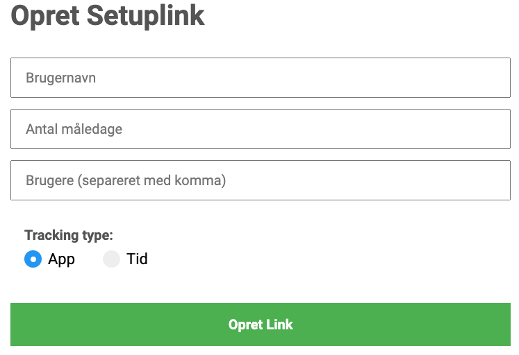

# SDU-Tracker-Setup

A simple webapp for generating links used to set up ActivityTracker for either [macOS](https://github.com/Bargsteen/SDU-Tracker) or [Windows](https://github.com/Bargsteen/SDU-Tracker-Windows), both of which are used for IT-health research at Syddansk University.

## Screenshot of the Webapp

